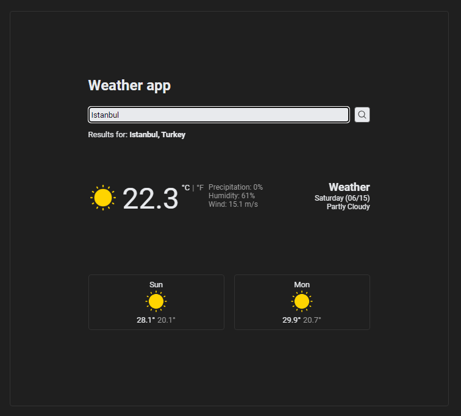

# weather-app

This is a simple weather application that allows users to input their location and fetch the current weather information for that location. The application displays the weather data on the webpage and includes a loading spinner that appears while fetching the data.

Live preview: https://taewookim02.github.io/weather-app/

## Features

- Fetch weather data for a given location.
- Display the weather information on the webpage.
- Show a loading spinner while fetching data.
- Responsive design with basic styling.
